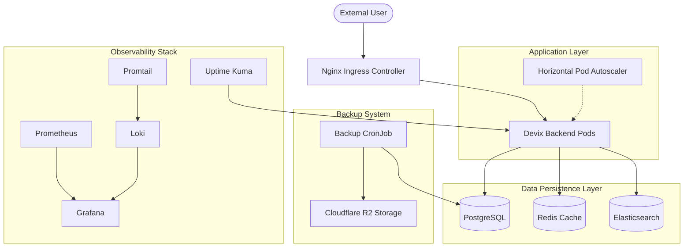

# Devix Staging Operations and Infrastructure Documentation

---

This document provides a comprehensive technical overview of the Kubernetes infrastructure, GitOps workflows, and operational procedures for the Devix backend platform staging environment.

---

## Technical Architecture Overview

The infrastructure is built on a modular "App of Apps" pattern, ensuring that all components—from core application services to monitoring and data persistence—are managed as code and automatically synchronized via ArgoCD.

### Infrastructure Diagram

---

## Component Specifications

### 1. Application Layer (Backend)
- **Scaling:** Horizontal Pod Autoscaling (HPA) v2.
- **Trigger:** CPU utilization exceeding 75%.
- **Pod Range:** Minimum 2, Maximum 5.
- **Rollout Strategy:** RollingUpdate (MaxSurge: 25%, MaxUnavailable: 0) ensuring zero downtime during deployments.

### 2. Data Layer (Stateful Services)
All stateful services are deployed as StatefulSets to ensure stable network identifiers and persistent disk attachment.

- **PostgreSQL:**
  - Image: `postgres:16-alpine`
  - Internal Hostname: `postgres-staging`
  - Internal Port: `5432`
  - Scaling: Vertical (Resource Limits: 512Mi RAM / 500m CPU)

- **Redis:**
  - Image: `redis:7-alpine`
  - Internal Hostname: `redis-staging`
  - Internal Port: `6379`
  - Scaling: Vertical (Resource Limits: 128Mi RAM / 200m CPU)

- **Elasticsearch:**
  - Image: `elasticsearch:8.11.1`
  - Internal Hostname: `elasticsearch-staging`
  - Internal Port: `9200`
  - Scaling: Vertical (Resource Limits: 2Gi RAM / 1000m CPU)

---

## Security Framework

### Secret Management
The environment utilizes **Bitnami SealedSecrets**. 
- Sensitive data is encrypted locally using the `kubeseal` utility.
- Encrypted manifests are committed to version control.
- Decryption occurs only at the cluster level via the Sealed Secrets Controller private key.

### Container Security
All deployments implement a strict SecurityContext:
- `runAsNonRoot: true`
- `allowPrivilegeEscalation: false`
- `readOnlyRootFilesystem: false` (enabled where persistent storage is required)

---

## Backup and Disaster Recovery

### Automated Database Exports
A Kubernetes CronJob executes a full database dump every 24 hours at 00:00 UTC.
- **Mechanism:** `pg_dump` utility.
- **Transport:** AWS CLI (S3-compatible mode).
- **Destination:** Cloudflare R2 Bucket.
- **Retention:** Managed via R2 Lifecycle policies.

---

## Local Development and Operations

### Cluster Interconnectivity
The `start-services.ps1` script automates the connection between the developer workstation and the private cluster network.

| Local Port | Target Service | Access URL |
| :--- | :--- | :--- |
| 8080 | ArgoCD Server | https://localhost:8080 |
| 3005 | Grafana Dashboards | http://localhost:3005 |
| 3001 | Uptime Kuma | http://localhost:3001 |
| 9091 | Prometheus | http://localhost:9091 |

### Administrative Access
Initial ArgoCD credentials can be retrieved via the automated script or by manually decoding the `argocd-initial-admin-secret` in the `argocd` namespace.

---

## Future Scaling and Optimization Roadmap

1. **Horizontal Database Scaling:** Transition to database operators (e.g., CloudNativePG) to support Primary/Replica clusters with automated failover.
2. **External Managed Persistence:** Migration of stateful workloads to managed cloud providers (Neon, RedisCloud) to offload operational overhead.
3. **Automated SSL/TLS:** Implementation of `cert-manager` for ACME-based certificate issuance and renewal via Let's Encrypt.
4. **Notification Integration:** Configuration of Prometheus AlertManager and Uptime Kuma webhooks for real-time incident alerting via Slack or PagerDuty.

---

**Document version: 1.1**
**Infrastructure maintainer: Devix Ops Team**
